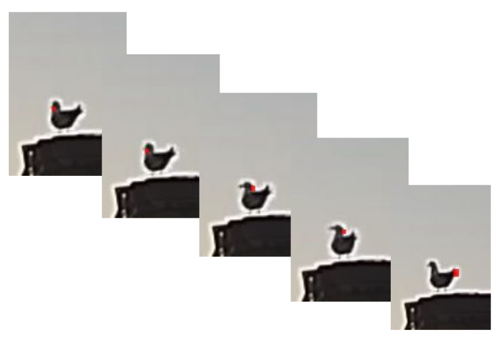
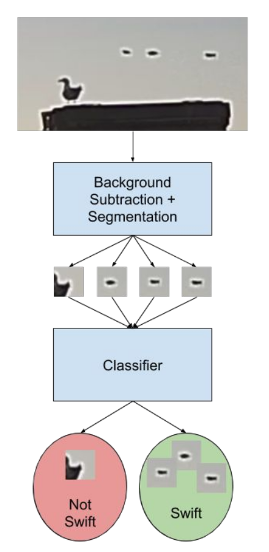

### swift-classification

> A sister project to the previous SwiftWatcher collaboration between the University of Victoria's Computer Vision Lab and Algoma SwiftWatch. Completed by Joshua Newton as part of Honours Thesis during Spring 2020 term.

The `swiftwatcher` project previously aimed to **detect, track, and analyze the motion** of chimney swifts in video footage. However, video footage typically contains the motion of more than just chimney swifts. _(For example, seagulls, crows, and other birds.)_ So, to prevent non-swift birds from being tracked, it would be useful to distinguish between chimney swifts and other types of birds.

Images will be extracted from available source videos using the existing `swiftwatcher` project. Then, these images will be separately curated into a new dataset using the tools created within this `swift-classification` repository. This new dataset will then be used to train and evaluate a machine learning classifier in an attempt to filter out non-swift motion. Once trained and evaluated, the model will then be integrated into the `swiftwatcher` project for inference purposes.

### Approach

This approach is undergoing active development. Preliminary proposed methods include:
 
 1. Haar-like features + AdaBoost classifier
 2. HoG features + SVM classifier
 3. Convolutional Neural Network-based classifiers
 
 These approaches will be explored in greater detail over the coming months.

### Further Reading

A presentation slide deck has been created, which provides greater detail into the problem domain and available datasets. The slide deck can be viewed using this link: [Chimney Swift Classification Overview.pdf](assets/Chimney Swift Classification Overview.pdf)
